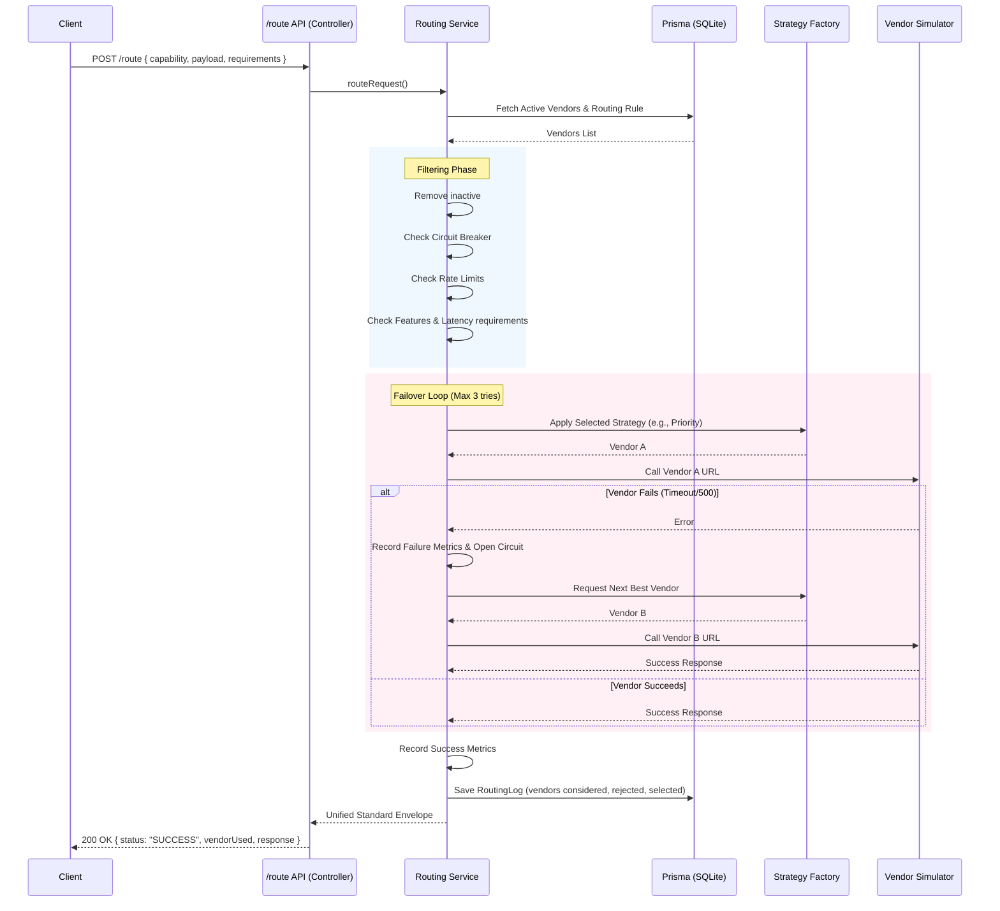

# Architecture

This document describes the request flow of the Intelligent Vendor Routing Platform.

## Request Flow Diagram

## Core Components
1. **Routing Service**: The orchestrator. Implements the failover loop.
2. **Strategy Factory**: Pure functions that take eligible vendors and return one.
3. **Metrics Engine**: An in-memory sliding window store capturing real-time latency and success rates to inform health-based and latency-based strategies.
4. **Circuit Breaker**: Prevents the system from making calls to a vendor that is known to be failing, saving valuable latency time.
